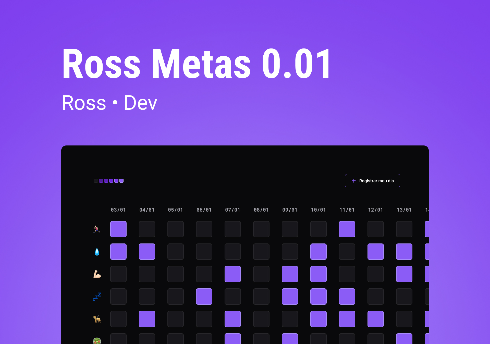

<h1 align="center"> RossDevLinks </h1>

Programa feito por Ross! com apoio da Rocketseat para ensino de tecnologias WEB.  

  <a href="#-tecnologias">Tecnologias</a>&nbsp;&nbsp;&nbsp;|&nbsp;&nbsp;&nbsp;
  <a href="#-projeto">Projeto</a>&nbsp

  

 

  
  

## 🚀 Tecnologias

Esse projeto foi desenvolvido com as seguintes tecnologias:

- HTML e CSS
- JavaScript
- Git e Github
- Figma

## 💻 Projeto

Ross metas e um app para ajudar nas metas do futuro DEV 😆

- [visite o projeto online](https://rossxx.github.io/Ross-Metas-0.1v/)

;)
